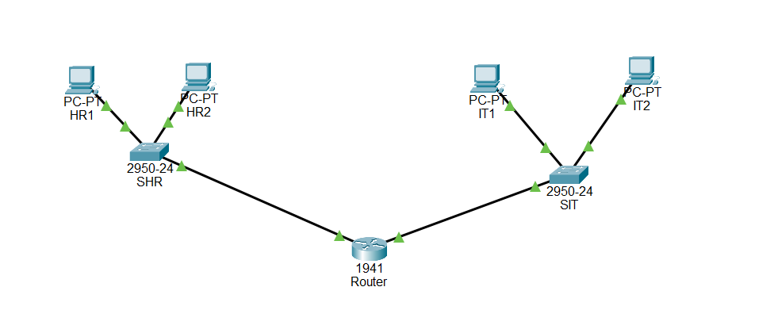
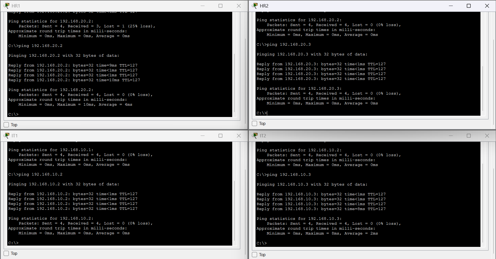

## 🧩 Topology

The setup has two separate networks, HR and IT, with a switch and two PCs on each side. R1 is in the middle and connects both networks.

## 📊 IP Addressing

| Device | Subnet | IP Address | Subnet Mask | Gateway |
|---|---|---|---|---|
| HR1 | HR | `192.168.10.2` | `255.255.255.0` | `192.168.10.1` |
| HR2 | HR | `192.168.10.3` | `255.255.255.0` | `192.168.10.1` |
| IT1 | IT | `192.168.20.2` | `255.255.255.0` | `192.168.20.1` |
| IT2 | IT | `192.168.20.3` | `255.255.255.0` | `192.168.20.1` |

HR uses `192.168.10.0/24` and IT uses `192.168.20.0/24`.

All the PCs were given static IPs, with the router interface on their network set as the default gateway.

## ⚙️ Router Configuration

R1 is handling the routing between the two subnets.

- `GigabitEthernet0/0` → `192.168.10.1/24` → HR
- `GigabitEthernet0/1` → `192.168.20.1/24` → IT

The router interfaces were configured with the IP addresses for their respective networks.

## 🖥️ Connectivity Testing

Tested connectivity between the PCs using `ping`.

HR and IT were able to communicate with each other through the router, with the ping tests showing `0% loss`.

So the inter-subnet routing is working properly and both networks can communicate through R1.
