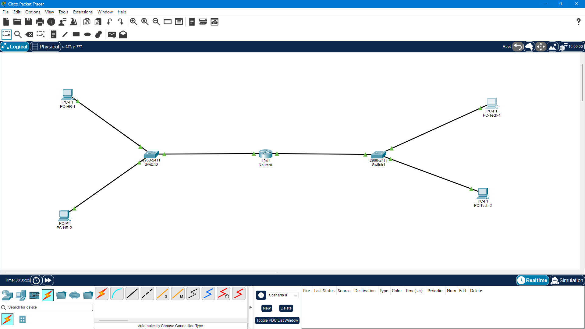
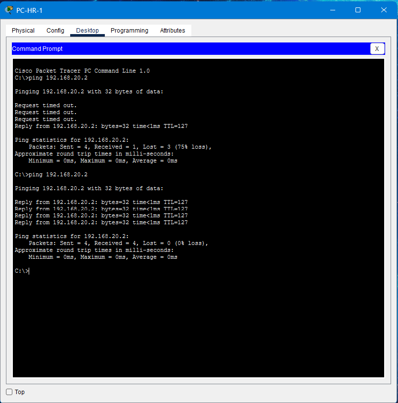
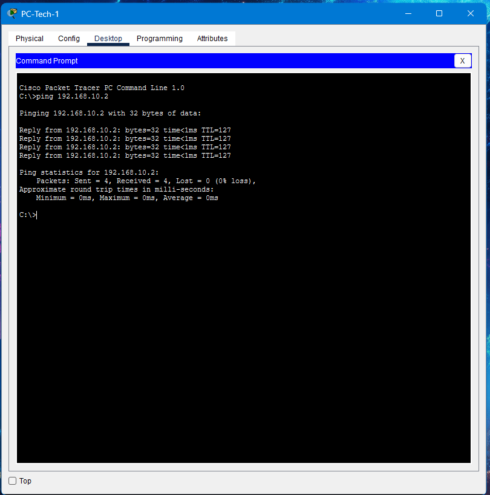

# Level 1 - Inter-Subnet Office Networking

## Topology

## Successful ping

## IP addressing table
(paste the table above)

## Router configuration
Router0 (Cisco 1941) connects to both switches. Gig0/0 faces the HR
switch with 192.168.10.1/24 and Gig0/1 faces the Tech switch with
192.168.20.1/24. Both interfaces were enabled with `no shutdown`.
Since both subnets are directly connected, the router routes between
them automatically, so no static routes were needed. Each PC uses its
subnet's router interface as its default gateway.
