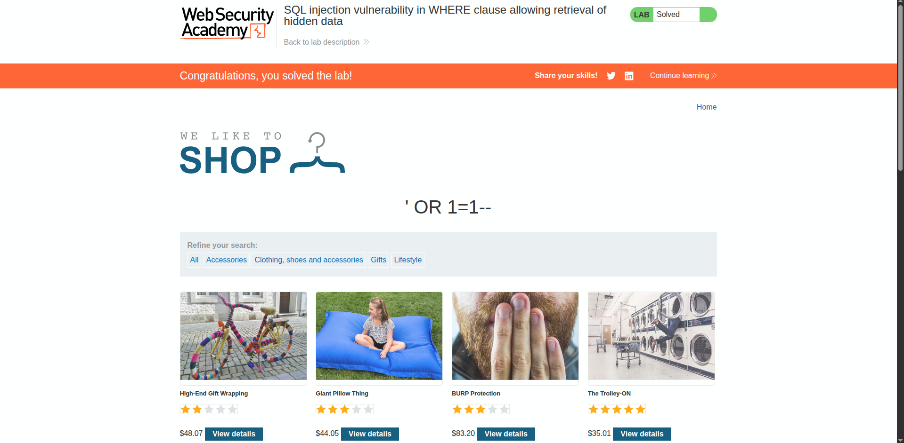
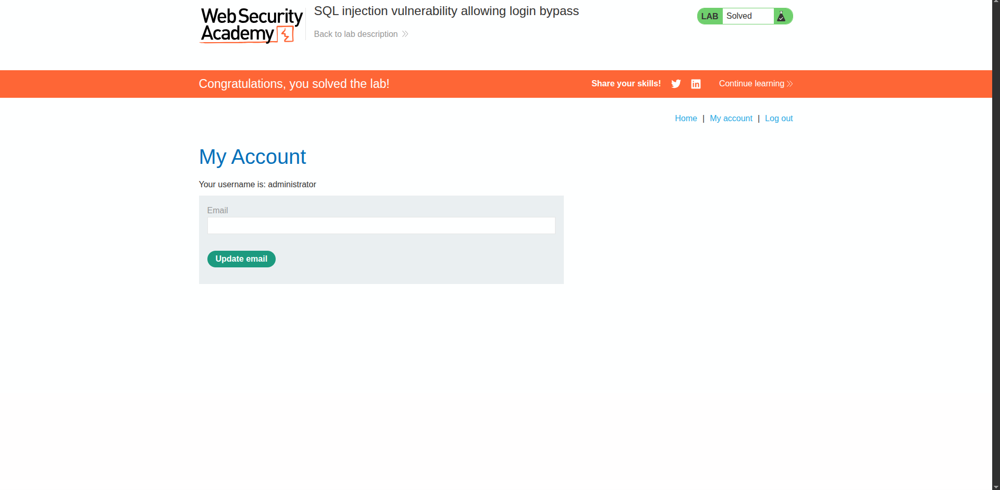

# Web SQL Injection

## Lab 1

### Injection Point

The vulnerable parameter was `category`.

### Payload

```text
+OR+1=1--
```

### What I did

I changed the `category` parameter to:

```text
+OR+1=1--
```

`OR 1=1` is always true, so the filter gets bypassed. The `--` comments out the rest of the SQL query.

### Result

The filter was bypassed and the hidden data was shown.



---

## Lab 2

### Injection Point

The vulnerable parameter was the `username` field in the login form.

### Payload

```text
administrator'--
```

### What I did

I entered:

```text
administrator'--
```

as the username and put any random value in the password field.

The `'` closes the username part of the query, and `--` comments out the rest. So the password check basically gets ignored.

### Result

I was able to log in as the `administrator` without knowing the actual password.

